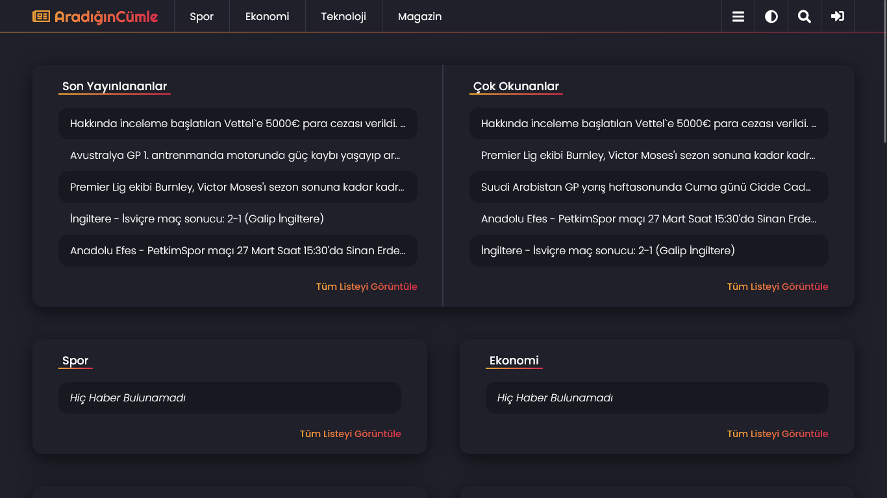
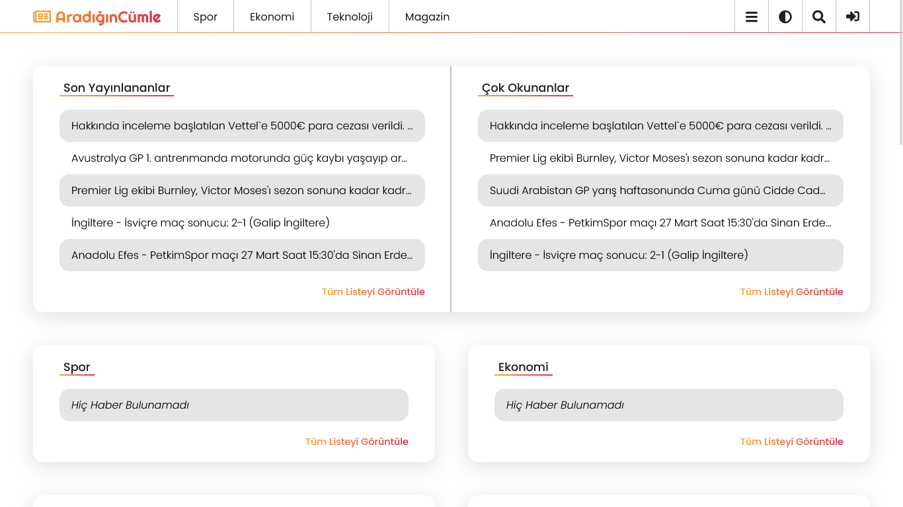

# Aradigin-Cumle

**_Aradigin Cumle_**

## Technologies

-   **Html**
-   **Css**
-   **JavaScript**
-   **Php**
-   **Laravel**

## Dependencies

-   _Font Awesome_
-   _Google Fonts(Poppins)_
-   _Google Fonts(Righteous)_

## Project Setup Process

### Install composer (for php packages)

```sh
composer install
```

### Create .env file

```sh
1. duplicate the ".env.example" in main folder
2. rename the file you copied to ".env"
3. configure the ".env" file you renamed
```

### Create app key

```sh
php artisan key:generate
```

### Run migrations (for create database tables)

```sh
php artisan migrate
```

### Run Seeders (for datas)

```sh
php artisan db:seed
```

### Run project

```sh
php artisan serve
```

<!--

*WebSite Link: [AradiginCumle.com](https://aradigincumle.com/)*

### To Do
* FrontEnd
  * yazar girişi sayfasının tasarımı ve responsive stili düzenlenecek
  * tüm butonlara 3d stili tanımlanacak
  * html elementine "lang" özelliği eklenecek
  * renkler ve font kalınlık-boyut değerleri düzeltilecek
* BackEnd
  * form verisi olan yerlerdeki sayfa yenilemesindeki işlemi tekrarlama olayını çöz
  * writings modelinin api controllerları yapılacak
  * my news list page controllerlarındaki list type sistemi yapılacak viewindeki title selectsler çalışır hale getirilicek

### Models
* Categories
* CategoryGroups
* CategoryGroupUrls
* CategoryTypes
* Constants
* ListingsDetail
* Listings
* News
* ReadingsDetail
* Readings
* ResourcePlatforms
* ResourceUrls
* Users
* UsersSettings
* UserTypes
* Visitors
* Writings

### Middlewares
* **isItAuthor**
  * *true* => kullanıcı hesabı varsa ve kullanıcı yazar ise geçişe izin verilir
  * *false* => kullanıcı hesabı yoksa yada kullanıcı yazar değilse 404 hata sayfasına yönlendirilir
* **isItSystem**
  * *true* => kullanıcı hesabı varsa ve kullanıcı sistem ise geçişe izin verilir
  * *false* => kullanıcı hesabı yoksa yada kullanıcı sistem değilse 404 hata sayfasına yönlendirilir
* **isItNotUser**
  * *true* => kullanıcı hesabı yoksa girişe izin verilir
  * *false* => kullanıcı hesabı varsa kullanıcı hesabı tipine göre panel yönlendirilmesi yapılır
* **userDataCheck**
  * *true* => kullanıcı hesabı varsa ve session üzerindeki kullanıcı bilgileri veritabanı ile uyuşuyorsa session güncellenir ve geçişe izin verilir
  * *false* => kullanıcı hesabı yoksa yada session üzerindeki kullanıcı bilgileri veritabanı ile uyuşmuyorsa userData session silinir 404 hata sayfasına yönlendirilir
* **isTheWebSiteSetup**
  * *true* => constants üzerindeki değerlerin varlığı kontrol edilir tamamı varsa ve tamamı geçerli değerler ise geçişe izin verilir
  * *false* => constants üzerindeki değerlerin varlığı kontrol edilir herhangi biri yoksa veya herhangi biri geçerli değer değil ise uygun olan kurulum aşamasına yönlendirilir
* **isTheWebSiteNotSetup**
  * *true* => constants üzerindeki değerlerin varlığı kontrol edilir herhangi biri yoksa veya herhangi biri geçerli değer değil ise geçişe izin verilir
  * *false* => constants üzerindeki değerlerin varlığı kontrol edilir tamamı varsa ve tamamı geçerli değerler ise anasayfa sayfasına yönlendirilir
* **isItVisitor**
  * *true* => userData session varsa geçişe izin verilir
  * *true* => userData session değeri yoksa ve visitorData session varsa geçişe izin verilir
  * *true* => hem userData değeri hem de visitorData değeri yoksa yeni bir visitor kaydı oluşturulup visitorData session değeri oluşturulur ve geçişe izin verilir
  * *false* => hem userData değeri hem de visitorData değeri varsa 403 hata sayfasına yönlendirilir
* **visitorDataCheck**
  * *true* => userData session varsa geçişe izin verilir
  * *true* => userData session değeri yoksa ve visitorData session değeri varsa visitorData içerisindeki değerler kontrol edilir değerler geçerli ise visitorData session değeri güncellenir ve geçişe izin verilir
  * *false* => visitorData session değeri yoksa bir önceki url adresine yönlendirilir
  * *false* => userData session değeri yoksa ve visitorData session değeri varsa visitorData içerisindeki değerler kontrol edilir değerler geçersiz ise visitorData session değeri silinir ve bi önceki url adresine yönlendirilir
* **userDataCheckIfIsUser**
  * *true* => userData session değeri yoksa geçişe izin verilir
  * *true* => userData session değeri varsa ve userData içerisindeki değerler kontrol edilir değerler geçerli ise userData session değeri güncellenir
  * *false* => userData session değeri varsa ve userData içerisindeki değerler kontrol edilir değerler geçersiz ise userData session değeri silinir ve yazar girişi sayfasına yönlendirilir

## Controllers

* Pages
  * Visitor
    * AllNewsListingsCheck
    * AllNewsReadingsCheck
    * Home
    * NewsDetail
    * NewsListingsWork
    * NewsReadingsWork
    * SignIn
    * SignOut
    * VisitorChangeWebSiteTheme
    * VisitorNewsList
  * Common
    * WebSiteSetup
  * Author
    * AuthorDashboard
    * AuthorSettings
    * MyNewsDelete
    * MyNewsEdit
    * MyNewsList
    * MyNewsStatisticDetail
    * MyNewsStatistics
    * MyNewStatisticTime
    * NewsCreate
  * System
    * CategoriesList
    * CategoryCreate
    * CategoryDelete
    * CategoryEdit
    * CategoryGroupCreate
    * CategoryGroupDelete
    * CategoryGroupEdit
    * CategoryGroupsList
    * CategoryGroupUrlEdit
    * CategoryGroupUrlsDelete
    * CategoryGroupUrlsList
    * CategoryTypeCreate
    * CategoryTypeDelete
    * CategoryTypeEdit
    * CategoryTypesList
    * NewsDelete
    * NewsEdit
    * NewsStatisticDetail
    * NewsStatistics
    * NewsStatisticTime
    * ResourcePlatformCreate
    * ResourcePlatformDelete
    * ResourcePlatformEdit
    * ResourcePlatformsList
    * ResourceUrlDelete
    * ResourceUrlEdit
    * ResourceUrlsList
    * SystemDashboard
    * SystemNewsList
    * SystemSettings
    * UserCreate
    * UserDelete
    * UserEdit
    * UserSettingDelete
    * UserSettingEdit
    * UserSettingsList
    * UsersList
    * UserTypeCreate
    * UserTypeDelete
    * UserTypeEdit
    * UserTypesList
    * VisitorBan
    * VisitorsList
    * VisitorUnBan
* Api
  * Categories
    * CategoryCreateController
    * CategoryDeleteController
    * CategoryEditController
    * CategoriesListController
  * CategoryGroups
    * CategoryGroupCreateController
    * CategoryGroupDeleteController
    * CategoryGroupEditController
    * CategoryGroupsListController
  * CategoryGroupUrls
    * CategoryGroupUrlsCreateController
    * CategoryGroupUrlsDeleteController
    * CategoryGroupUrlsEditController
    * CategoryGroupUrlsListController
  * CategoryTypes
    * CategoryTypesCreateController
    * CategoryTypesDeleteController
    * CategoryTypesEditController
    * CategoryTypesListController
  * Constants
    * ConstantsListController
    * ConstantsUpdateController
  * ListingsDetail
    * ListingsDetailCreateController
    * ListingsDetailDeleteController
    * ListingsDetailEditController
    * ListingsDetailListController
  * Listings
    * ListingsCreateController
    * ListingsDeleteController
    * ListingsEditController
    * ListingsListController
  * News
    * NewsCreateController
    * NewsDeleteController
    * NewsEditController
    * NewsListController
  * ReadingsDetail
    * ReadingsDetailCreateController
    * ReadingsDetailDeleteController
    * ReadingsDetailEditController
    * ReadingsDetailListController
  * Readings
    * ReadingsCreateController
    * ReadingsDeleteController
    * ReadingsEditController
    * ReadingsListController
  * ResourcePlatforms
    * ResourcePlatformsCreateController
    * ResourcePlatformsDeleteController
    * ResourcePlatformsEditController
    * ResourcePlatformsListController
  * ResourceUrls
    * ResourceUrlsCreateController
    * ResourceUrlsDeleteController
    * ResourceUrlsEditController
    * ResourceUrlsListController
  * Users
    * UsersCreateController
    * UsersDeleteController
    * UsersEditController
    * UsersListController
  * UserTypes
    * UserTypesCreateController
    * UserTypesDeleteController
    * UserTypesEditController
    * UserTypesListController
    * UserSignInController
  * UserSettings
    * UserSettingsCreateController
    * UserSettingsDeleteController
    * UserSettingsEditController
    * UserSettingsListController
  * Visitors
    * VisitorsCreateController
    * VisitorsDeleteController
    * VisitorsEditController
    * VisitorsListController
  * Writings
    * WritingsCreateController
    * WritingsDeleteController
    * WritingsEditController
    * WritingsListController

## Pages / Views

* Visitor
  * Home
  * News Detail
  * News List
  * Sign In
* Author
  * Dashboard
  * Delete Confirm
  * My News Edit
  * My News List
  * My News Statistic Detail
  * My News Statistic Time
  * My News Statistics
  * News Create
  * Settings
    * My Account
    * Theme
* System
  * Categories List
  * Category Create
  * Category Edit
  * Category Group Create
  * Category Group Edit
  * Category Group Url Edit
  * Category Group Urls List
  * Category Groups List
  * Category Type Create
  * Category Type Edit
  * Category Types List
  * Dashboard
  * Delete Confirm
  * News Edit
  * News List
  * News Statistic Detail
  * News Statistic Time
  * News Statistics
  * Resource Platform Create
  * Resource Platform Edit
  * Resource Platform List
  * Resource Url Edit
  * Resource Urls List
  * Settings
    * Constants
    * My Account
    * Theme
  * User Create
  * User Edit
  * User Setting Edit
  * User Settings List
  * User Type Create
  * User Type Edit
  * User Types List
  * Users List
  * Visitors List
-->
